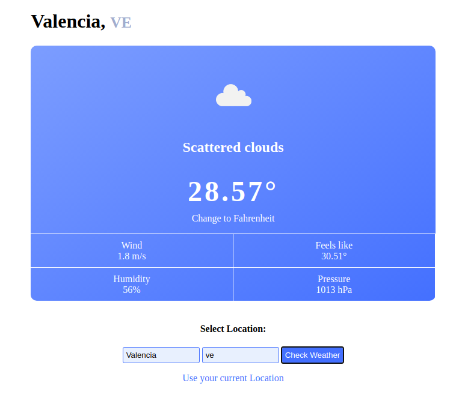

# Weather-App

> This is an app that can show you the weather on any location you want. You can even check the weather on your current location.



## Built With

- Javascript ES6
- OpenWeatherMap API
- WebPack
- HTML
- CSS
- VS Code

## How to Install

- Install Node in your system. To install Node, you can read the [Documentation](https://nodejs.org/en/download/package-manager/)
- Clone the repo or download the zip file into your machine. 
    ``` 
   git clone https://github.com/Miguelus373/Weather-App.git
    ``` 
- On your terminal, CD into the Weather-App folder and run
    ``` 
   npm install
    ``` 
- This will install all the dependancies.

- Then open the index.html in your browser (or use a local server)

## Author  

👤 **Miguel Uzcátegui**

- Github: [@miguelus373](https://github.com/miguelus373)
- Linkedin: [Miguel-Uzcátegui](https://www.linkedin.com/in/miguelus/)


## 🤝 Contributing

Contributions, issues and feature requests are welcome!. Feel free to check the [issues page](https://github.com/Miguelus373/Weather-App/issues).

## Show your support

Give a ⭐️ if you like this project!

## 📝 License
This project is [MIT](https://github.com/Miguelus373/Weather-App/blob/develop/LICENSE) licensed.